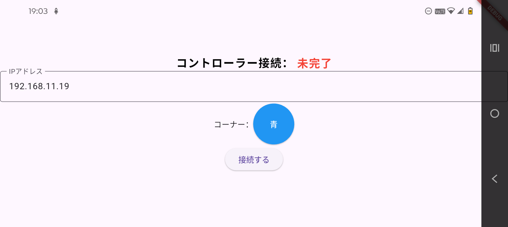
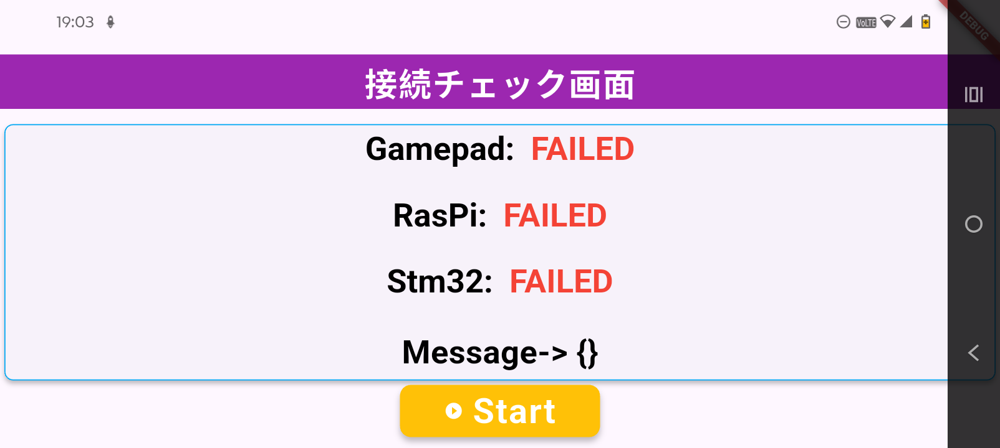
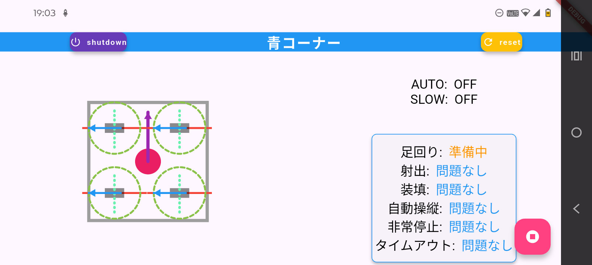
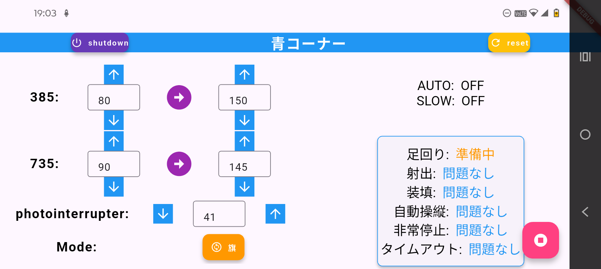
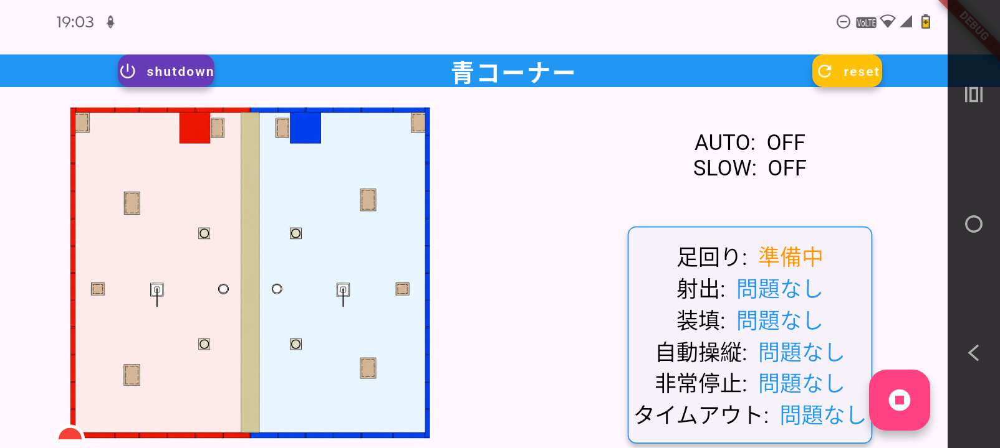

# nhk_robocon_2026_controller

## 概要
高専ロボコン2026用に作成した。スマホを用いたコントローラーです。flutterで開発しています 
ゲームコントローラー(GameSir G8 Galileo)を取り付け動かしています

## 操作方法
左スティック：ロボットの移動
右スティック：ロボットの旋回
B：射出動作開始、停止
A：装填を動かす
X：右側に表示される画面の変化(独ステの回転角度か現在位置か、また射出の数値設定)
Y：オートモード開始、停止(今は無効化している)
RB、LB：ロボットの移動を遅くする

## 使用されている技術
- cupertino_icons
- web_socket_channel
- gamepads
- provider

## 工夫点
- ROS2と連動できるようになっている
- ROS2からのデータをもとにどこに問題が出ているか、画面に表示されるようになっている
- 画面右側にロボットが現在どこにいるか映る(ようにしたと思う。まだやっていない)。自動化する際使用
- 独ステ一つ一つどのくらい回転しているかを表示できる。これでもし回転しすぎているときに視覚的に分かるようになる。あと、見た目がよくなる

## サンプル画像
### 1. 接続画面
        
        画面中央でラズパイのIPアドレス設定し、接続のボタンを押すことで始まります。また、青コーナーか赤コーナー 化を設定することや、スマホコントローラーが接続されているかをチェックすることができます。
### 2. 接続チェック画面
    　  
        ラズパイとstm32、スマホコントローラーに接続されているかを確かめることができます。下のエラー欄でどんな問題があるのかを判断することができます。下のStartボタンを押すことでゼロ点リセットを開始します。
### 3. 操作画面
        
        画面右側では射出等どこか問題がないかや足回りの状態を判断することができます。また停止ボタンを押すことで機構にロックをかけたり、ラズパイを遠隔でシャットダウンしたりしています。 
        左側は横にスクロールかXボタンを押すことにより、画面が変わります。 
        上の画面では独ステがどの方向に向いているかを判断することができます。

        
        こちらでは射出のモーターの出力やどのタイミングで離すかを細かく設定したり、射出する場所を変えることができます。

        
        こちらではロボットがフィールドのどこにいるかが右下点で表示されるようになってます。とはいいつつ自己位置推定がなくなり、必要なくなったためほぼ無用画面です。いつか使いたい…
        

## ライセンス
このアプリで用いられる画像については[ライセンス](./assets/README.md)を見てください
